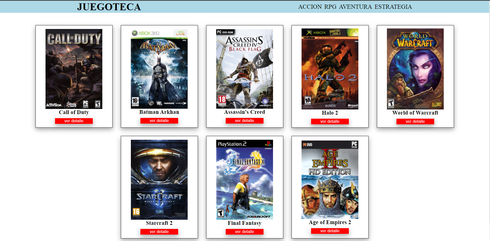
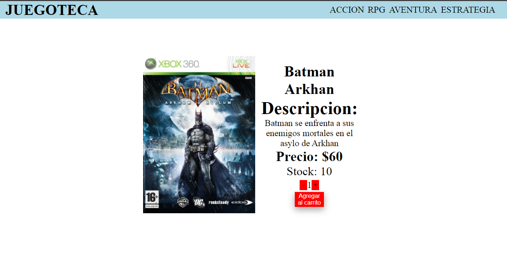
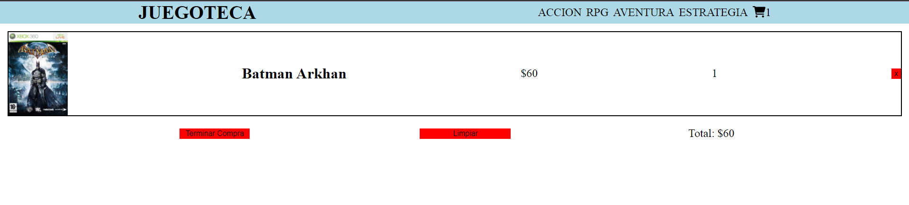

# E-COMMERCE Project in ReactJs

## Proyect Description

The project is an E-commerce created with React.js and other libraries. The project is just a layout with some features of an E-commerce.

## Libraries

    * React.js (v17.0.2)
    * Font Awesome for React (v0.1.17)
    * React-router-dom (v6.2.2)
    * React-toastify (v8.2.0)
    * Firebase (v9.6.10)

## implementation
React.js: It was used as the application development interface.

Font Awesome for React: Library of icons for the application.

React-router-dom: npm package that allowed to implement dynamic routing in the web application.

React-toastify: It was used for pop-up notifications to users.

Firebase: It was used as a database environment.

CSS: Libraries for the style sheet were not implemented.

## Project Link and photos

[Link to the repository](https://github.com/Tankerfranco/FrancoNegrete-App.git)
[Link to the project](https://lucky-buttercream-2c813c.netlify.app)

## installation

1. Open Git Bash.

2. Change the current working directory to the location where you want to clone the directory.

3. Type 'git clone', and then paste the URL you copied from the GitHub repository.
~~~
$ git clone https://github.com/Tankerfranco/FrancoNegrete-App.git
~~~

4. Install the necessary repository dependencies. On the command line, run the following command:
~~~
npm install
~~~

5. Run the application.
~~~
npm start
~~~
  
